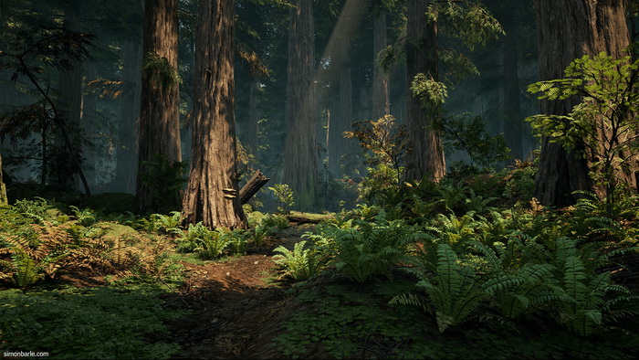

# 목차
[컨셉](#컨셉) 
[서브컨셉](#서브컨셉) 
[관련 이미지 & 동영상](#관련-이미지-&-동영상) 
[대표 이미지](#대표-이미지) 
[구성 요소](#[구성-요소]) 
[게임 오브젝트 분해 (구성 요소 분석)](#게임-오브젝트-분해-&#40;구성-요소-분석&#41;) 
[파라미터 (속성) 뽑아 보기](#파라미터-(속성)-뽑아-보기) 
[행동 뽑아 보기](#행동-뽑아-보기) 
[상태 뽑아 보기](#상태-뽑아-보기) 
[플레이어 캐릭터 속성 (파라미터)](#플레이어-캐릭터-속성-(파라미터)) 
[게임의 규칙](#게임의-규칙) 
[게임에서 사용될 공식](#게임에서-사용될-공식) 
[요구사항](#요구사항) 
[흐름도](#시간별-흐름도) 
[개발일지](#개발-일지)

# 게임 이름 : covert operation

# [컨셉]
## 헌터 : 
- 적을 사냥하며 플레이어의 순발력과 대처능력을 발휘해 다양한 무기를 응용하여 난관을 헤쳐나가도록 구현.
- 장르 : 슈팅, 어드벤처

 

# [서브컨셉]
### 사운드 : 
- 사운드는 플레이어의 몰입도에 직접적 영향을 줌.예를 들어 총기가 발사되고 뒤늦게 소리가 난다면 플레이에 악영향을 끼침.

- 타격감 또한 사운드가 어느정도 영향이 있기에 적당한 사운드를 찾아 적용시키는 것이 중요함.

### 맵 : 
- 숲이나 폐허같은 맵을 구현해 어두운 분위기를 연출

### 간략함 : 
- 많은 요소를 구현해 유저에게 혼란을 주기보단 간단하게 필요한 요소만 구현

### 속도감 : 
- 빠른 전투와 많은 적을 상대함으로서 지루할 틈이 없도록 구현

### 도전 정신 : 
- 적당히 어려운 난이도로 유저의 도전 정신을 일깨움으로서 클리어하겠다는 의지를 심어줌

  
# [관련 이미지&동영상]
- 이미지  
  

 
- 동영상  
https://youtu.be/djt7IWjACNc Alien Breed  
https://youtu.be/n_WJdDoE_Lk 데드네이션   
https://youtu.be/zLEq_K4mQ4c 로스트아크  

  
# [대표 이미지]

 

  
# [구성 요소]

 

## 1. 메커니즘

### [도전 과제]
- 맵에 존재하는 모든 적을 섬멸해라

### [재미 요소]
- 여러 무기를 사용해 적을 죽일 수 있다.
- 적을 죽일 때 타격감을 느낄 수 있다.

 

## 2. 이야기

### [만들게 된 배경]  
- 미확인 물체의 추락지점에 탐사대가 파견되었지만 연락이 두절 되었고 그 탐사대를 찾으러 간 군인의 모습이다.

### [카메라 관점]  
- 처음 적을 마주한 장면이다.

 

## 3. 미적요소

[카메라] 
- 쿼터뷰로 유저가 넓은 시야를 확보할 수 있다.

[분위기]  
- 지구가 외계인에게 침략 당한 스토리이기 때문에 어두운 분위기로 연출되어 있다.
	
[디자인]
- 적의 종류마다 모델이 다르고 공격속도와 이동속도가 다르다.

[음향]
- 적이 죽을 때마다 죽어가는 소리를 냅니다.
 

## 4. 기술  
- 유니티 <버전 미정>
  

# 게임 오브젝트 분해 (구성 요소 분석)

## 1. 오브젝트 이름 : 플레이어

   

## 2. 오브젝트 이름 : 지형

   

## 3. 오브젝트 이름 : 총

   

## 4. 오브젝트 이름 : 보조 스킬

   

## 5. 오브젝트 이름 : 적 (근접)

   

## 6. 오브젝트 이름 : 적 (장거리)

   

## 7. 오브젝트 이름 : 적 (보스)

   

# 파라미터 (속성) 뽑아 보기

## 1. 오브젝트 이름 : 플레이어
- 체력 : 100 
- 이동 속도 : 1  
- 공격력 : 5 ~ 15 
- 사거리 : 10

 체력은 100으로 시작하며 플레이어의 이동 속도는 게임 이동 속도의 기준이다.  랜덤으로 5 ~ 15 데미지를 입히며 최대 사거리는 10이다.

  

## 2. 오브젝트 이름 : 지형
- none

 게임의 지형 오브젝트이다. 

  

## 3. 오브젝트 이름 : 총
- 반동 : 1 ~ 2 
- 연사 : 한 발당 과열 + 1  
- 과열 MAX : 100 

 플레이어의 기본 무기이다. 반동은 탄 퍼짐을 뜻하며 한 발당 총기가 1 씩 과열되며  과열 MAX인 100을 찍으면 쏠 수 없게 된다.

  

## 4. 오브젝트 이름 : 보조 스킬
- 공격력 : 100 
- 쿨타임 : 12 sec 
- 범위 : 6 

 플레이어의 보조 스킬이다. 공격력 100이라는 막강한 데미지를 가졌으며  12 초에 한 번씩 사용할 수 있다. 범위가 6 이기 때문에 적이 몰려 있거나  강력한 적에게 던지는 용도로 쓰인다. 

  

## 5. 오브젝트 이름 : 적 (근접)
- 체력 : 30 
- 이동 속도 : 2  
- 공격력 : 1 ~ 5 
- 사거리 : 1

 체력이 30으로 낮고 이동 속도가 플레이어의 두 배지만 사거리가 1 로 근접 공격을 한다.

  

## 6. 오브젝트 이름 : 적 (원거리)
- 체력 : 25 
- 이동 속도 : 1.5  
- 공격력 : 3 ~ 7 
- 사거리 : 4

 체력은 적(근접)보다 낮지만 사거리 4로 원거리 공격이 가능하다.  이동 속도도 플레이어보다 0.5 높고 공격력은 3 ~ 7 이다.

  

## 7. 오브젝트 이름 : 적 (보스)
- 체력 : 600 
- 이동 속도 : 1  
- 공격력 : 12 ~ 15 
- 사거리 : 2

 체력은 600 이며 이동 속도는 플레이어와 같다.  공격력은 12 ~ 15로 근접이지만 사거리는 2 이다.

  

# 행동 뽑아 보기

## 1. 오브젝트 이름 : 플레이어

1. 걷기 : 이동키를 누르면 걸어간다.
2. 총 쏘기 : 공격 버튼을 누르면 총이 나간다.
3. 둘러 보기 : 플레이어의 시점이 마우스 포인터를 따라간다.
  

## 2. 오브젝트 이름 : 지형

### none
 

## 3. 오브젝트 이름 : 총

1. 발사 : 공격 버튼을 누르면 발사가 된다.
2. 열 식히기 : 발사하지 않을 때는 올라갔던 열이 식는다.
  

## 4. 오브젝트 이름 : 보조 스킬

1. 던지기 : 스킬 버튼을 누르면 스킬이 나간다.
2. 터지기 : 터지면서 데미지를 입힌다.
  

## 5. 오브젝트 이름 : 적 (근접)

1. 달리기 : 플레이어에게 달려간다.
2. 공격 : 플레이어를 공격한다.
  

## 5. 오브젝트 이름 : 적 (원거리)

1. 걷기 : 플레이어가 사거리에 들어올 때까지 이동한다.
2. 쏘기 : 플레이어에게 원거리 공격을 한다.
  

## 5. 오브젝트 이름 : 적 (보스)

1. 달려들기 : 플레이어에게 달려간다.
2. 휘두르기 : 플레이어에게 공격을 휘두른다.
   

# 상태 뽑아 보기

## 1. 오브젝트 이름 : 플레이어

1. 대기 -> 이동
- 조건 : 이동키를 누름
2. 대기 -> 공격
- 조건 : 공격 버튼을 누름
3. 대기 -> 둘러보기
- 조건 : 마우스를 이동함
  

## 2. 오브젝트 이름 : 지형

### none
 

## 3. 오브젝트 이름 : 총

1. 대기 -> 발사
- 조건 : 발사 버튼을 누름
2. 대기 -> 열 식히기
- 조건 : 총을 발사하지 않음
  

## 4. 오브젝트 이름 : 보조 스킬

1. 대기 -> 던지기
- 조건 : 스킬 버튼을 누름
2. 대기 -> 터지기
- 조건 : 스킬이 시전됨
  

## 5. 오브젝트 이름 : 적 (근접)

1. 대기 -> 달리기
- 조건 : 플레이어를 발견함
2. 대기 or 달리기 -> 공격
- 조건 : 플레이어가 공격 사거리 안에 들어오면 공격함
  

## 6. 오브젝트 이름 : 적 (원거리)

1. 대기 -> 걷기
- 조건 : 플레이어를 발견함
2. 대기 or 걷기 -> 쏘기
- 조건 : 플레이어가 공격 사거리 안에 들어오면 공격함
  

## 7. 오브젝트 이름 : 적 (보스)

1. 대기 -> 달려들기
- 조건 : 플레이어를 발견함
2. 대기 or 달려들기 -> 휘두르기
- 조건 : 플레이어가 공격 사거리 안에 들어오면 공격함
   

# 플레이어 캐릭터 속성 (파라미터)

## 이동 (Move)
- 키보드를 이용하여 플레이어가 캐릭터를 조종함

## 체력 (Health)
- 플레이어의 캐릭터가 체력이 0이 되면 캐릭터 죽음

## 사격 (Fire)
- 과열 값이 100 이상이 되지 않는 한 계속 발사할 수 있음

## 스킬 (Skill)
- 플레이어가 스킬 버튼을 누르면 스킬이 나감

  

# 게임의 규칙

- <h2>핵심 규칙

1. 플레이어는 하드 모드와 노멀 모드를 선택할 수 있다.
2. 플레이어는 모든 적을 섬멸해야한다.
3. 게임 도중에 종료하게 되면 모든 데이터를 잃게 된다.
4. 플레이어 사망 시 처음부터 다시 해야한다.

- <h2>보조 규칙

1. 플레이어는 맵 밖으로 나갈 수 없다.
2. 모든 적을 섬멸하지 않으면 게임이 끝나지 않는다.

  

# 게임에서 사용될 공식

1. 모든 적을 섬멸하는 것을 중점으로 모든 적을 섬멸 했을 때 게임에서 승리하게 된다.
2. 적과 플레이어의 거리가 어느 정도 가까워지면 적이 플레이어를 발견하고 추적한다.
3. 적끼리 공격은 통하지 않는다.
4. 플레이어의 공격은 관통된다.

  

## 요구사항 (1년)

- 시작 씬, 게임 씬, 엔딩 씬(Bad ending), 엔딩 씬(Happy ending)으로 총 4개의 씬이 있다.

- 시작화면에서는 게임 시작 버튼과 게임 종료 버튼이 있다.

- 게임 시작 버튼을 누르면 노멀모드와 하드코어 모드가 있는데 두개 중 한가지를 선택해 누르면 게임 씬으로 이동하며 게임 종료 버튼을 누르면 게임이 종료된다.

- 하드코어 모드에서는 게임 씬 안에 있는 적들에게 단 한대도 맞지 않고 적들을 모조리 잡아야한다.

- 게임 씬에는 현재 남은 적의 숫자, 자신의 캐릭터, 스폰된 적, 맵, 스킬창, 체력이 표시된다.

- 조작은 키보드와 마우스가 있는데 키보드로는 이동 및 스킬 사용을 할 수 있으며, 마우스를 이용해 원하는 방향에 공격을 할 수 있다.

- 게임 씬에서 적을 죽이며 나아가다보면 적의 보스가 등장하는데 그 보스는 다른 적보다 체력도 많고 강하다.

- 게임 씬 안에 있는 모든 적을 사살하면 게임은 플레이어의 승리로 해피엔딩을 볼 수 있다.

- 게임 씬 안에 있는 적들을 사살하지 못하고 되려 당한다면 배드엔딩을 보게 된다.

- 해피엔딩 씬과 배드엔딩 씬은 메뉴로 돌아가기 또는 게임 종료하기 버튼 두개가 있다.

## 요구사항 (6 주)

- 시작 씬, 게임 씬, 엔딩 씬(Bad ending), 엔딩 씬(Happy ending)으로 총 4개의 씬이 있다.

- 시작화면에서는 게임 시작 버튼과 게임 종료 버튼이 있다.

- 게임 시작 버튼을 누르면 노멀모드와 하드코어 모드가 있는데 두개 중 한가지를 선택해 누르면 게임 씬으로 이동하며 게임 종료 버튼을 누르면 게임이 종료된다.

- 하드코어 모드에서는 게임 씬 안에 있는 적들에게 단 한대도 맞지 않고 적들을 모조리 잡아야한다.

- 하드코어 모드에서는 적들의 공격력이 100 이상으로 올라간다.

- 게임 씬에는 현재 남은 적의 숫자, 자신의 캐릭터, 스폰된 적, 맵, 스킬창, 체력이 표시된다.

- 적의 남은 숫자는 작은 글씨로 우측에 써져 있고 체력은 좌측 하단에 있다. 

- 카메라는 캐릭터를 중심으로 고정되어 있다.

- 스킬창은 중앙 하단에 있다.

- 조작은 키보드와 마우스가 있는데 키보드로는 이동 및 스킬 사용을 할 수 있으며, 마우스를 이용해 원하는 방향에 공격을 할 수 있다.

- 키보드의 W, A, S, D 로 움직일 수 있으며 캐릭터는 마우스 커서 쪽으로 방향을 튼다.

- 마우스 왼쪽 버튼을 누르면 공격이 나간다.

- 게임 씬에서 적을 죽이며 나아가다보면 적의 보스가 등장하는데 그 보스는 다른 적보다 체력도 많고 강하다.

## 시간별 흐름도

   

## 키보드 이벤트에 대한 흐름도

   

## 용어 정리

   

## 스토리보드

   

### 1. [시네마 이벤트] 운석이 떨어지는 모습을 보여주고 있다.
### 2. [시네마 이벤트] 운석이 떨어진 모습을 보여주고 있다.
### 3. [시네마 이벤트] 사령관이 플레이어에게 임무를 부여하고 있는 모습을 보여주고 있다.
### 4. [인 게임 1단계] 자동차에서 내려 목표 지점으로 이동하는 모습을 보여주고 있다.
### 5. [인 게임 마지막 단계] 보스를 만나고 대치하는 모습을 보여주고 있다.
### 6. [시네마 이벤트] 적을 섬멸하고 기지에 지원 요청을 하여 적의 본거지가 초토화 되고 있는 모습을 보여주고 있다.

 
 

## 개발일지

   
